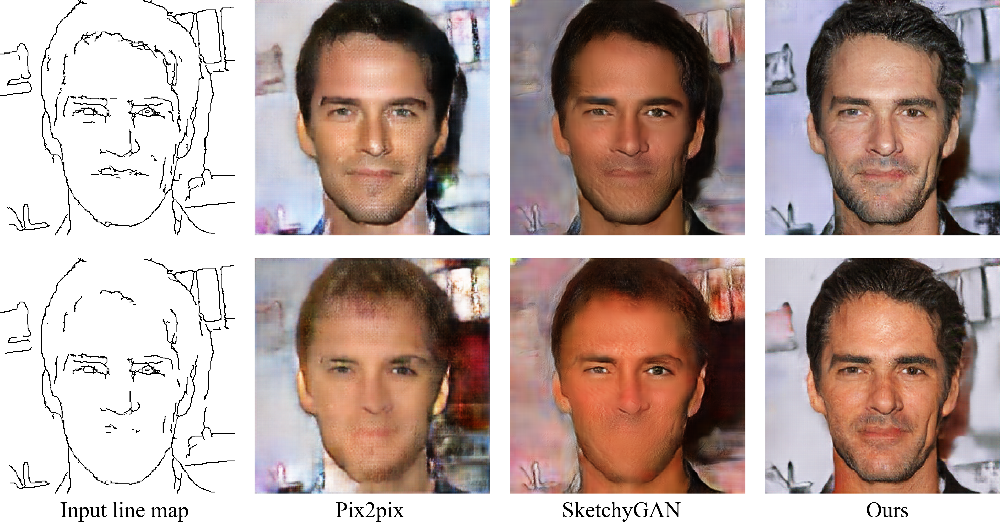

# Lines2Face
This is the official implementation of paper **LinesToFacePhoto: Face Photo Generation from Lines with Conditional Self-Attention Generative Adversarial Network**. 

Working in progress...



### Prerequisites
TensorFlow 1.8.0, Python 3.6, NumPy, scipy, PIL, tqdm

### Data
We use TFrecord file for our dataset. See /tools/Image_mask_edge_df.py for details. Since the TFrecord file we use may be redundant, you can modify it to meet your need.

The face photo dataset we use is [CelebA-HQ](https://github.com/tkarras/progressive_growing_of_gans).

The method we use to get line maps is the same as that in [SketchyGAN](https://github.com/wchen342/SketchyGAN), which is basicall [HED](https://github.com/s9xie/hed) + postprocessing. 

Distance fields (df's) are obtaind by distance transform.

The masks are not used in this project.

### Links 
[Project page](https://liyuhangustc.github.io/Lines2Face/)

[Paper](https://arxiv.org/abs/1910.08914)

### Cite
```
@inproceedings{Li:2019:LFP:3343031.3350854,
 author = {Li, Yuhang and Chen, Xuejin and Wu, Feng and Zha, Zheng-Jun},
 title = {LinesToFacePhoto: Face Photo Generation From Lines With Conditional Self-Attention Generative Adversarial Networks},
 booktitle = {Proceedings of the 27th ACM International Conference on Multimedia},
 series = {MM '19},
 year = {2019},
 isbn = {978-1-4503-6889-6},
 location = {Nice, France},
 pages = {2323--2331},
 numpages = {9},
 url = {http://doi.acm.org/10.1145/3343031.3350854},
 doi = {10.1145/3343031.3350854},
 acmid = {3350854},
 publisher = {ACM},
 address = {New York, NY, USA},
 keywords = {conditional generative adversarial nets, face, line map, realistic images, self-attention},
} 
```

### Credits
MRU code by [SketchyGAN](https://github.com/wchen342/SketchyGAN)

Self-atttention modual code modified from [Self-Attention-GAN-Tensorflow](https://github.com/taki0112/Self-Attention-GAN-Tensorflow)

Some code by [pix2pix-tensorflow](https://github.com/affinelayer/pix2pix-tensorflow)
