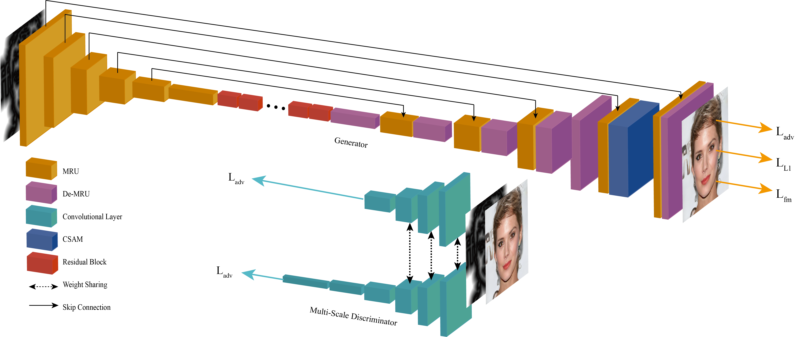

# LinesToFacePhoto: Face Photo Generation from Lines with Conditional Self-Attention Generative Adversarial Network

Yuhang Li, <a href="http://staff.ustc.edu.cn/~xjchen99" target="_new">Xuejin Chen*</a>, Feng Wu, and Zheng-Jun Zha

National Engineering Laboratory for Brain-inspired Intelligence Technology and Application

University of Science and Technology of China

**Figure 1**: From sparse lines that coarsely describe a face, photorealistic images can be generated using our conditional self-attention generative adversarial network (CSAGAN). With different levels of details in the conditional line maps, CSAGAN generates realistic face images that preserve the entire facial structure. Previous works fail to synthesize certain structural parts (i.e. the mouth in this case) when the conditional line maps lack corresponding shape details.

## Abstract
In this paper, we explore the task of generating photo-realistic face images from lines. Previous methods based on conditional generative adversarial networks (cGANs) have shown their power to generate visually plausible images when a conditional image and an output image share well-aligned structures. However, these models fail to synthesize face images with a whole set of well-defined structures, e.g. eyes, noses, mouths, etc., especially when the conditional line map lacks one or several parts. To address this problem, we propose a conditional self-attention generative adversarial network (CSAGAN). We introduce a conditional self-attention mechanism to cGANs to capture long-range dependencies between different regions in faces. We also build a multi-scale discriminator. The large-scale discriminator enforces the completeness of global structures and the small-scale discriminator encourages fine details, thereby enhancing the realism of generated face images. 
We evaluate the proposed model on the CelebA-HD dataset by two perceptual user studies and three quantitative metrics. The experiment results demonstrate that our method generates high-quality facial images while preserving facial structures. Our results outperform state-of-the-art methods both quantitatively and qualitatively.

## Architecture

**Figure 2**: The architecture of our model. The proposed CSAM (the blue block) is added before the last convolutional layer. The multi-scale discriminator (only two are drawn) are applied to encourage the generator to produce realistic results with  complete structure and delicate textures.

## Results

**Figure 3**: The above face images are generated from line maps using three methods: pix2pix, SketchyGAN (without the classification network), and our proposed method. Groundtruth(GT) images that we use to obtain the line maps are shown in the right-most column. The results generated by our model contain more details, especially in the areas with hairs, whiskers, and highlighted regions. Also, our results appear more realistic with regard to the illumination of faces.

## Acknowledgements:
This work was supported by the National Key Research & Development Plan of China under Grant 2016YFB1001402, the National Natural Science Foundation of China (NSFC) under Grants 61632006, 61622211, and 61620106009, as well as the Fundamental Re-search Funds for the Central Universities under Grants WK3490000003 and WK2100100030.

## Downloads
[Paper]()

Code:coming soon.
